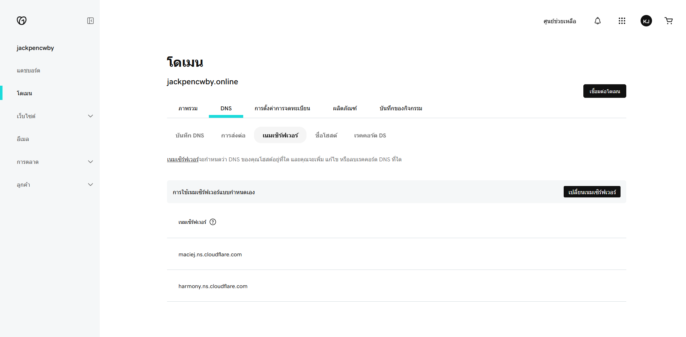
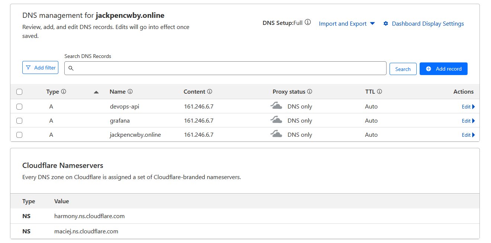
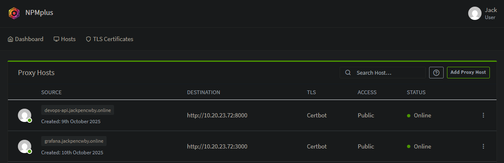
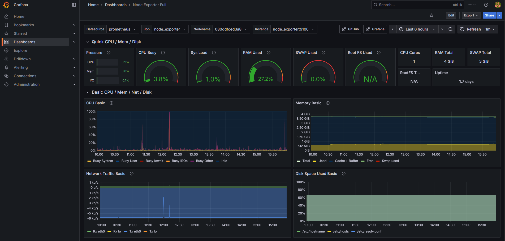
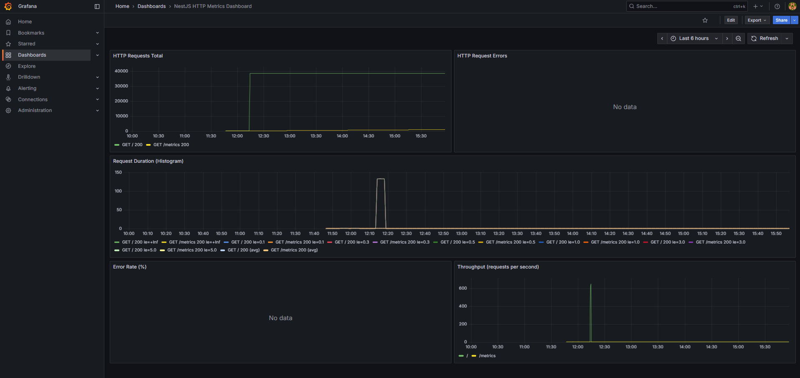

# DevOps Project

This project demonstrates a DevOps workflow from CI/CD automation to server infrastructure management, monitoring, reverse proxy and domain configuration.

---

## 🚀 Tech Stack

| Category | Technology |
|-----------|-------------|
| **Backend Framework** | NestJS |
| **Database** | PostgreSQL (with TypeORM) |
| **Database Management** | pgAdmin |
| **CI/CD** | GitHub Actions |
| **Containerization** | Docker |

---

## 🧰 Tools & Technologies

### CI/CD
- **GitHub Actions**
- **Self-hosted Runner** — Used for Continuous Deployment (CD) that run on a private server (private IP) within the same local network as the deployment server.
- **Dockerfile** — Defines how the NestJS app is built into a Docker image.
- **Docker Compose (on Server)** — Runs services:
  - PostgreSQL + pgAdmin
  - Prometheus + Node Exporter + Grafana

### Infrastructure as Code
- **Ansible** — Manages and configures the server environment. 
  The playbooks in this project handle:
  - Common server setup  
  - Firewall configuration  
  - Docker installation  
  - Database setup  
  - Monitoring stack (Prometheus, Node Exporter, Grafana)

### Monitoring
- **Prometheus** 
- **Node Exporter**   
- **Grafana**

---

## 🌐 Domain & Reverse Proxy Configuration

demonstrates how to connect a registered domain to your private server through Cloudflare and a reverse proxy.

1. **Register a Domain and change Domain Nameservers to Cloudflare**
   
   

2. **Point Domain to Reverse Proxy (Public IP)**  
   The reverse proxy routes traffic from Cloudflare to internal network.

   

3. **Forward Domain to Internal Server (Private IP via NPM)**  
   Using **Nginx Proxy Manager (NPM)** on private server (running on Proxmox).

   

---

## 📊 Monitoring 

### 🖥️ Node Exporter Metrics

### ⚙️ NestJS Application Metrics

---
